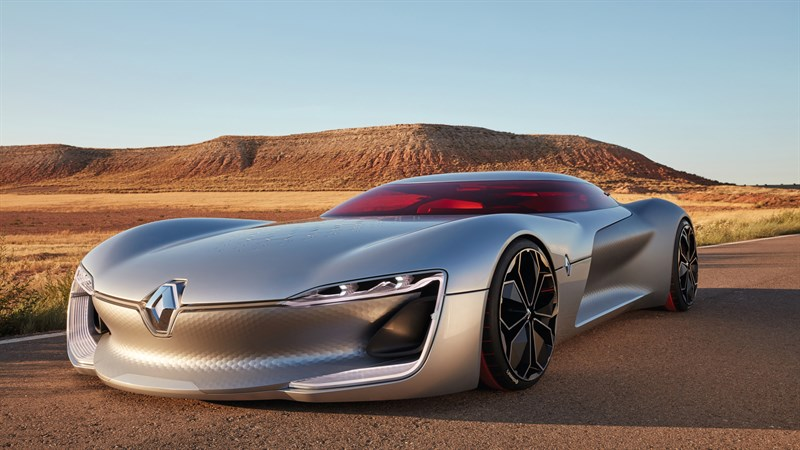

# Teachable Machine - Image Classification
**Student Names:** Naser Al Owaimer
**Student Numbers:** 445102817

## Project Description

This project utilizes Google's Teachable Machine to train an AI model for image classification as part of a college course (IS201). The model is trained on a dataset consisting of images of various classes and is designed to classify images into these categories. The project was chosen due to an interest in applying machine learning techniques to practical problems and leveraging Google's user-friendly Teachable Machine platform to facilitate the process.

---

## Section One: Data Collection

The training data for this project was sourced from Kaggle datasets, specifically image sets of bikes, cars, and airplanes. The datasets used include:
- Bikes and Cars image sets: [Kaggle Dataset](https://www.kaggle.com/datasets/pavansanagapati/images-dataset?resource=download)
- Airplanes image set: [Kaggle Dataset](https://www.kaggle.com/datasets/nelyg8002000/commercial-aircraft-dataset?select=1_Liner+TF)

The images were organized into different folders for each class to facilitate the training process. Could be found in `datasets` folder. Additionally, the data was preprocessed to ensure consistency in image size and format.

---

## Section Two: Model Training

### Training Process:
The model was trained using the Teachable Machine platform. The steps involved included uploading the images, labeling them according to their classes, and training the model using the platform's built-in tools. One challenge encountered was ensuring sufficient and balanced data across all classes to avoid bias in the model.

### Performance Analysis with Varying Data:
[Table template for analysis]

| Class           | 40 Images (%) | 60 Images (%) | 100 Images (%) |
|-----------------|---------------|---------------|----------------|
| Car             |72.6%          |61.4%          |77.2%           |
| Bike            |78.2%          |84.75%         |76.25%          |
| Airplane        |74%            |79.8%          |80%             |

---

## Section Three: Model Testing

**Testing Results:**
Using the test set images (in `testset` folder), the model's accuracy was calculated manually.

Accuracy = (Number of correct predictions / Total number of predictions)

[Table template for testing results]

| Test Image | Predicted Class | Actual Class | Correct/Incorrect |
|------------|-----------------|--------------|-------------------|
||Airplane (57%) |Car|Incorrect|
||Airplane (100%)|Airplane|Correct|
||Airplane (100%)|Airplane|Correct|
||Airplane (100%)|Airplane|Correct|
||Bike (72%)|Airplane|Incorrect|
||Airplane (99%)|Airplane|Correct|
||Bike (100%)|Bike|Correct|
||Bike (59%) |Bike|Correct|
||Car (51%) |Bike|Incorrect|
||Bike (99%) |Bike|Correct|
||Car (94%) |Car|Correct|
||Car (53%) |Car|Correct|
||Car (98%) |Car|Correct|
||Car (99%) |Car|Correct|

**Interesting Cases:**
[Table template for interesting cases]

| Test Image | Description |
|------------|-------------|
||This is very wiered that having an AI-generated image for a vichel with 3 natures: bike, car, and airplane. When the classiy model thinks it is a bike 100%.|
||This is also AI-generated image for a flying car, while the classiy model thinks it is a bike!|
||The same with the pase image. Wiered!|
||This have a small percentage to be an airplane :)|
||What is happening with this model!!!|
||Ok, this image is real photo that have both the airplane and the car in front of it.|

---

## Section Four: Conclusion

Through this project, I learned about the practical steps involved in training and testing a machine learning model for image classification. This experience highlighted the importance of data quality and quantity in achieving accurate predictions and provided insights into the challenges of model training, such as handling imbalanced datasets. Overall, this project has deepened my understanding of machine learning and its applications in computer science.